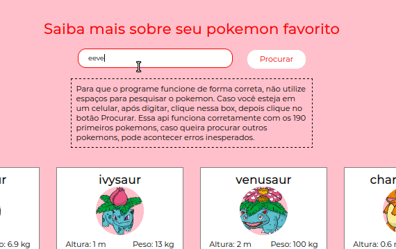
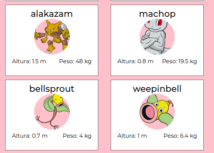
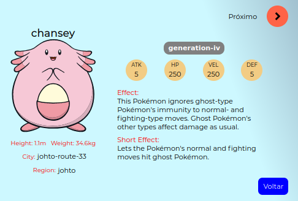
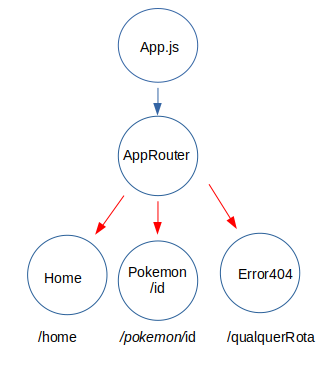

<header>
    <center>
        <h1>Pokedex ReactJS</h1>
        <h2>🚧 Status: projeto finalizado ✅ </h2>
        
    </center>
</header>
<br>
<h2>Tecnologias utilizadas 💻 </h2>

* [Javascript](#https://www.javascript.com/)
* [HTML 5](#https://html.com/html5/)
* [CSS 3](#https://www.w3.org/Style/CSS/Overview.en.html)
* [ReactJS](#https://pt-br.reactjs.org/)
  
<h2>Bibliotecas usadas 🗂</h2>

* [React Router DOM](#https://www.npmjs.com/package/react-router-dom)
* [StyledComponents](#https://styled-components.com/)

<h2 align="center">Sumário</h2>


- <p style="color:#2782dd">Sobre</p>
- <p style="color:#2782dd">Rotas</p>
- <p style="color:#2782dd">API</p>
- <p style="color:#2782dd">Requisitos</p>
  
<h2 style="color:#ffe811">Metas</h2>


         [x] Entender como funciona a pokeAPI               ✅
         [x] Requisições assíncronas                        ✅
         [x] Ciclo de vida dos componentes no React         ✅
         [x] Renderização da página com useEffect           ✅
         [x] Componentes estilizados com styled components  ✅
         [x] Gerenciamento de rotas dentro do App           ✅   
<br>
<br>
<br>
<br>
<br>
<br>


## Sobre
<article>
Este projeto cosiste em criar uma pokedex, ou seja, uma listagem de pokemons com base na PokeAPI, que lista uma infinidade de dados para que seja possível mostrar a parte visual do projeto. Segue uma amostra divididas em duas partes de como a pokedex funciona:
<br>
<br>
<Strong>
<h4>Pokedex</h4>
<p>
A primeira parte, retorna 150 pokemons para o usuário poder ver informações gerais. Como o peso, altura e seus atributos:
</p>

<br>

<br>Já a segunda página, retorna o pokemon específico digitado pelo usuário. Mostrando mais sobre o pokemon escolhido:
<br>


</strong>
</article>
</br>
</br>

## Rotas
Para que seja possível navegar em uma SPA (Single PAge Aplication) é necessário que tenha certos caminhos que o desenvolvedor deve fazer para retornar sempre uma única página. A biblioteca React Router DOM ajuda nesse processo, com o uso correto da ferramenta, é possívelindicar rotas que no fim gera uma página somente.<br> Abaixo, mostro o circuito de rotas que desenvolvi nessa aplicação:
</br>




</br>
</br>
O app.js renderiza a árvore de componentes, o que aparece na tela. Pórem é o componente <strong>AppRouter</strong> que selecionará qual componente deve ser renderizado, a partir da url local, para navegar entre as páginas, basta usar um componente da prórpia biblioteca Router DOM chamado <.Link>. Para usá-lo basta inserí-lo dessa forma:
<br>
 <code><Link to="caminho">Clique aqui</Link> </code>

</br>
</br>

## API

Para entender como a PokeAPI funciona, vou seprar em dois caminhos: 

1. Pókemons gerais
2. Pókemon dados únicos


<h2 style="color:#2782dd">Pókemons gerais:</h2>

```

const initialUrl = "https://pokeapi.co/api/v2/pokemon?limit=150&offset=0";

useEffect(() => {
async function fetchData() {
    let response = await getAllPokemon(initialUrl);

await loadingPokemon(response.results);
}

fetchData();
}, []);

const loadingPokemon = async (data) => {
    let _pokemonData = await Promise.all(
      data.map(async (pokemon) => {
        let pokemonRecord = await getPokemon(pokemon.url);
        return pokemonRecord;
      })
    );
    setPokemonData(_pokemonData);
  };


```
<i>Function -> getAllPokemon</i>

```
// Essa função se encontra em api.js na pasta service/

export async function getPokemon(url){
    return new Promise ((resolve, reject) => {
        fetch(url)
        .then(res => res.json())
        .then(data => {
            resolve(data);
        })
    })
}

```

Para fazer a requisição, é necessário colocá-la dentro do useEffect, para que cada atualização dentro do [ ] retorne uma nova renderização.
Depois de pegar os 150 pokemons iniciais, caso você veja na doc principal, ele retornará:

-[0]

Pokemon:1</br>
pokemonURL -> essa url pega todos os dados do pokemon específico.</br>

<br>
Ou seja, para cada objeto dentro do array loadingPokemon, deve-se fazer uma nova requisição, para isso, é necessário usar Promisse.all, para que as requisições individuais sejam feitas.
</br>
</br>
</br>
<h2 style="color:#2782dd">Pókemon individual:</h2>


Para fazer as requisições individuais, segue o código:
```
useEffect(() => {
    async function getData() {
      const requestOne = await api.get(`pokemon/${idHandle}`);
      const requestTwo = await api.get(`ability/${idHandle}`);
      const requestThree = await api.get(`location/${idHandle}`);
  
      axios.all([requestOne, requestTwo, requestThree]).then(
        axios.spread((...allData) => {
          const allDataDados = allData[0].data;
          const allDataAbility = allData[1].data;
          const allDataLocation = allData[2].data;
  
          setDados(allDataDados);
          setAbility(allDataAbility);
          setLocation(allDataLocation);
        })
      ).catch((err) => {
        return console.error(`ops! ocorreu um erro  ${err}`)
      });
    }
    getData();
    setTimeout(loadingHidden,4000);
  }, [idHandle]);

```

Aqui há um ponto a ser comentado: 

Foi necessário fazer 3 requisições do mesmo pokemon, cada uma trazendo dados especiífos como:

- Localização
- Habilidades
- Dados gerais do pokemon

</br>
Para fazer 3 requisições, caso use o método axios para obter os dados via GET, é necessário usar <i>axios.all</i> ela garantirá que a próxima ação, seja feita somente depois das 3 requisições funcionarem, ou seja, dá uma sincronia ao código.

</br>
</br>
</br>

## Requisitos

Eae curtiu?

Se quiser ver na prática basta clicar no link abaixo:</br>

<a href="https://pokedex-v2-coelho-react.netlify.app/" target="_blank">Site Pokedex</a></br>

Para ver o código basta clicar aqui:

<a href="https://github.com/GuiCoelho-S/Pokedex-v2-Coelho" target="_blank">Github code</a></br>

<h2 align="center">Como rodar na máquina local?</h2>

Para rodar na máquina local, é necessário possuir o node.js instalado na máquina, além dessas bibliotecas:

```
npm install styled-components
```

```
npm install react-router-DOM
```

Espero que gostem, até o próximo projeto !! 🚀🚀🚀